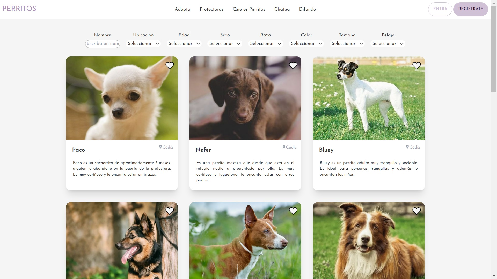
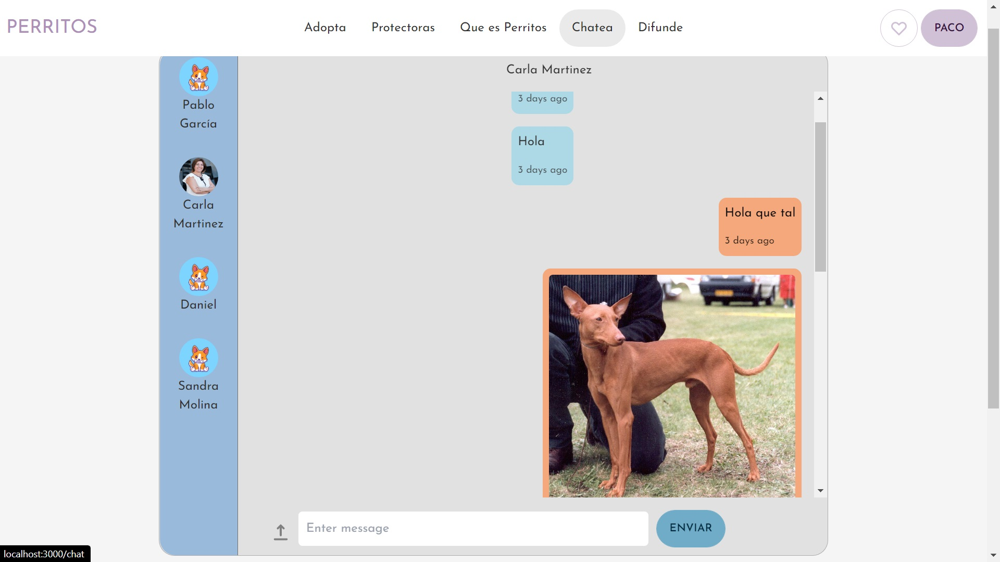

# Perritos Project
## Description
This app was created as the Final Project of the React Course at the IT Academy - Barcelona.

## Developers
- @Laura-Ruiz
- @BoccoSantiago

## What is this app about? 

You will be able to: 
- Search with different filters dogs looking for home around Spain.
- Chat with people offering pets in adoption.
- Post lost pets or pets in adoption.
- Save your favorite dogs to get in contact to the shelters later.

[See deployed web here](https://BoccoSantiago.github.io/Perritos/)

## Techlonogies in use

- REACT JS
- CSS
- CONTEXT
- FIREBASE
- TAILWIND & DAISYUI
- TOASTIFY
- REACT ICONS 
- CHART JS
- GOOGLE MAPS API

## Screen shots

## How to install
1. Clone this repository 
    > `git clone https://github.com/Laura-Ruiz/perritos-adoption.git`
2. Access the app directory
    > `cd <repository folder>`
4. Installation 
    >`npm install`
    >>`npm install firebase chartjs chartjs2 daisyui @react-google-maps/api moment react-toastify react-social-media-embed react-icons`
5. Run
    >`npm run start`
## How to use
**IMPORTANT! To access some parts of the application you must first Sign Up then Log In with your created user.**

